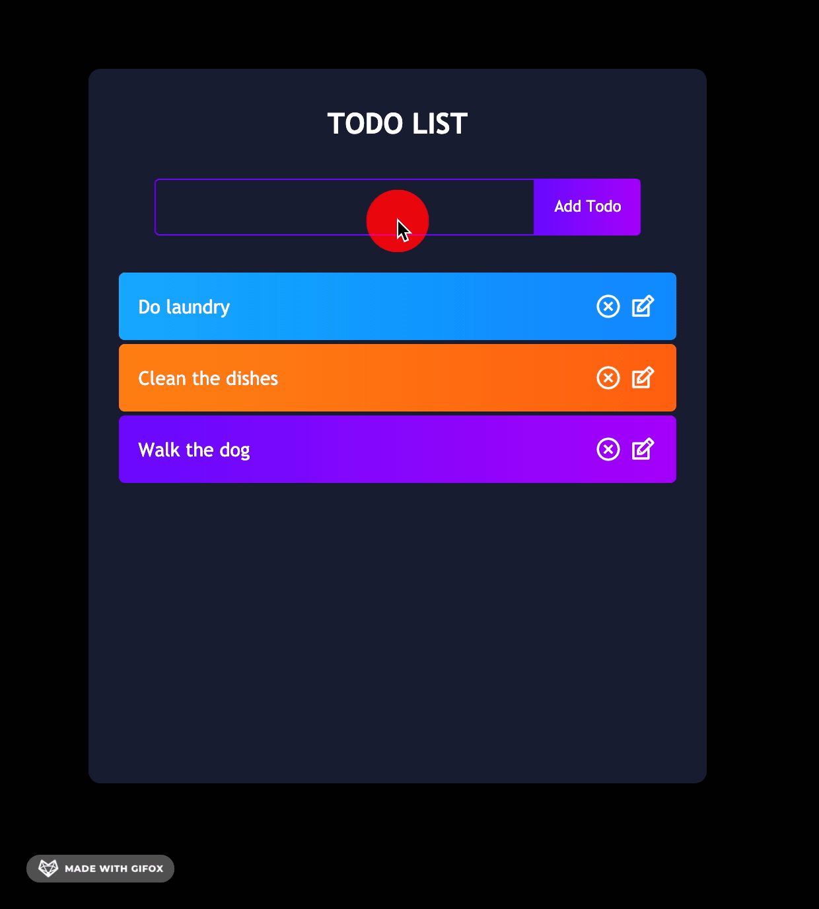
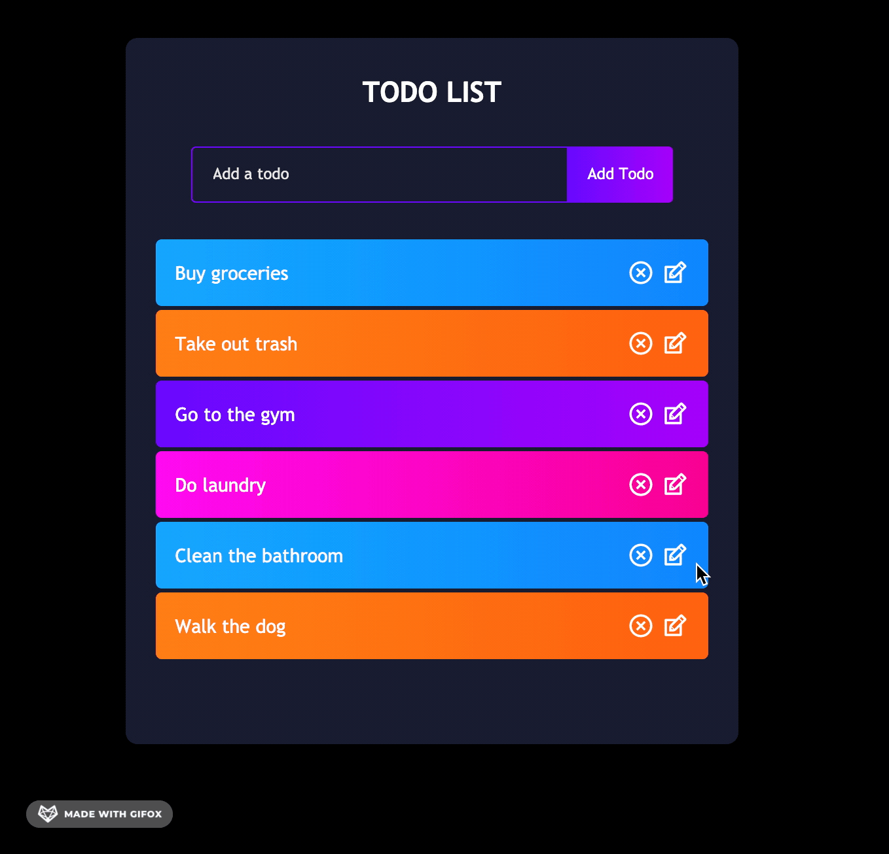
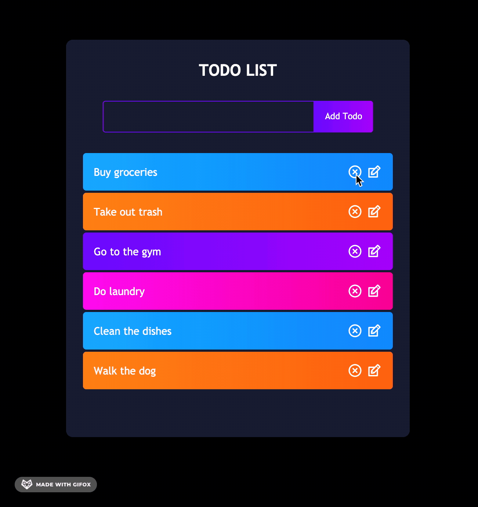

# Todo List
Simple React app to implement CRUD. (Create, Read, Update, Delete)
## Available Scripts

In the project directory, you can run:

Make sure to "yarn install" to get all the dependencies before running.

### `yarn start`

Runs the app in the development mode.\
Open [http://localhost:3000](http://localhost:3000) to view it in the browser.

# 
### Create and Complete tasks:

### Update tasks:

### Delete tasks:

